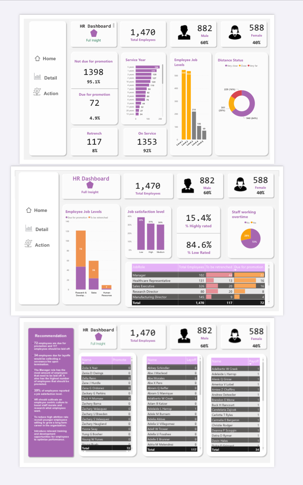

# HR Analytics

## Introduction
HR Analytics is defined as a specialized form of data analytics that involves usage of employee-related data and analytical processes to improve HR performance level and employee retention. The data collected is used to help the management make informed decisions with respect to attrition rates and employee retention. 

HR analytics aims at answering the following questions:
What is the employee value and retention rate?
What is the approximate attrition rate?
How many employees deserve a promotion?
What is the employee turnover rate? 

## Analysis
1. I built the data model
2. I proceeded to create new measures using DAX
- Total Employees = COUNTROWS('HR Analytics Data')
- % Due = DIVIDE([Due for promotion],[Total Employees],0)
- % Not due = DIVIDE([Not due for promotion], [Total Employees], 0)
- Male = CALCULATE([Total Employees],'HR Analytics Data'[Gender]="Male")
- % male = DIVIDE([Male],[Total Employees],0)
- Female = CALCULATE([Total Employees],'HR Analytics Data'[Gender]="Female")
- % female = DIVIDE([Female],[Total Employees],0)
- High rated = CALCULATE([Total Employees],'HR Analytics Data'[Performance_Rating]= "High")
- % Highly rated = DIVIDE([Highly rated],[Total Employees],0)
- Low rated = CALCULATE([Total Employees],'HR Analytics Data'[Performance_Rating]= "Low")
- % Low Rated = DIVIDE([Low rated],[Total Employees], 0)
- No of Payoffs = COUNTROWS('SeveranceData (2)')
- Due for promotion = IF(ISBLANK(CALCULATE([Total Employees],'HR Analytics Data'[Promotion_Status] = "Due")), 0, CALCULATE([Total Employees],'HR Analytics Data'[Promotion_Status] = "Due"))
- Not due for promotion = CALCULATE([Total Employees],'HR Analytics Data'[Promotion_Status] = "Not Due")
- To be retained = IF(ISBLANK(CALCULATE([Total Employees],'HR Analytics Data'[Retrenchment_Status]= "Retain")),0, CALCULATE([Total Employees],'HR Analytics Data'[Retrenchment_Status]= "Retain"))
- % To be retained = DIVIDE([To be retained],[Total Employees],0)
- To be retrenched = IF(ISBLANK(CALCULATE([Total Employees],'HR Analytics Data'[Retrenchment_Status]= "Layoff")),0,(CALCULATE([Total Employees],'HR Analytics Data'[Retrenchment_Status]= "Layoff")))
- % to be retrenched = DIVIDE([To be retrenched],[Total Employees], 0)

## Visualization
You can interact with the report [here](HR_analytics.pbix)

## Insights
1. 72 employees are due for promotion and 117 employees should be laid off.
2. 34 employees due for layoffs would be collecting a severance fee upon termination.
3. The Manager role has the most amount of employees that need to be laid off. It also has the highest number of employees that should be promoted.
 4. 39% of employees reported a job satisfaction level.

## Recommendations
HR could improve employee experience by
- Assessing candidates relevant skills and comptencies diligently befor hiring
- Recruit younger employees willing to grow a long term career in the organization.
- Introduce relevant training and development opportunities for employees to optimize performance.

